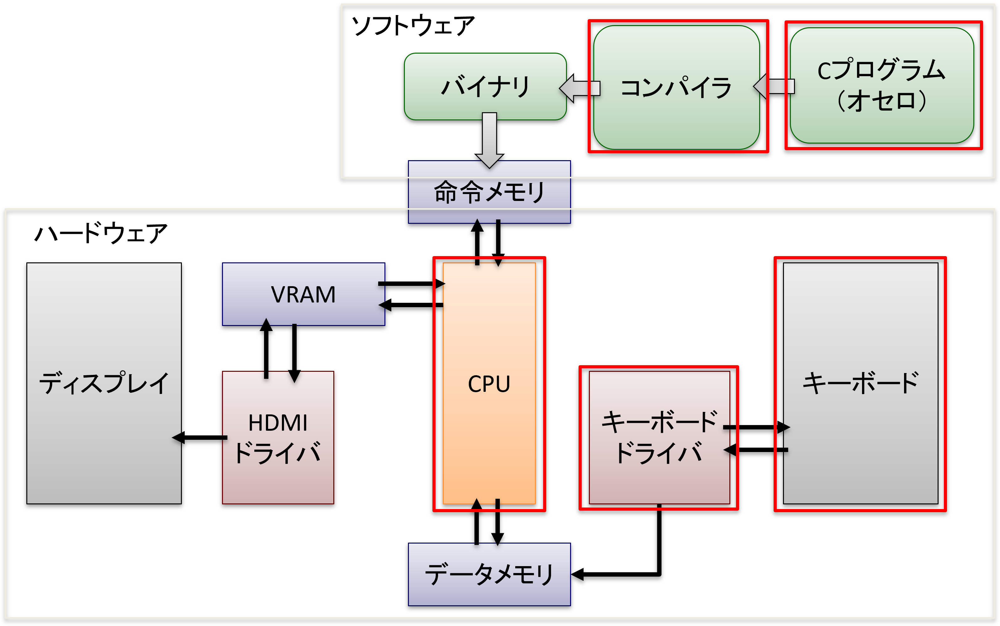
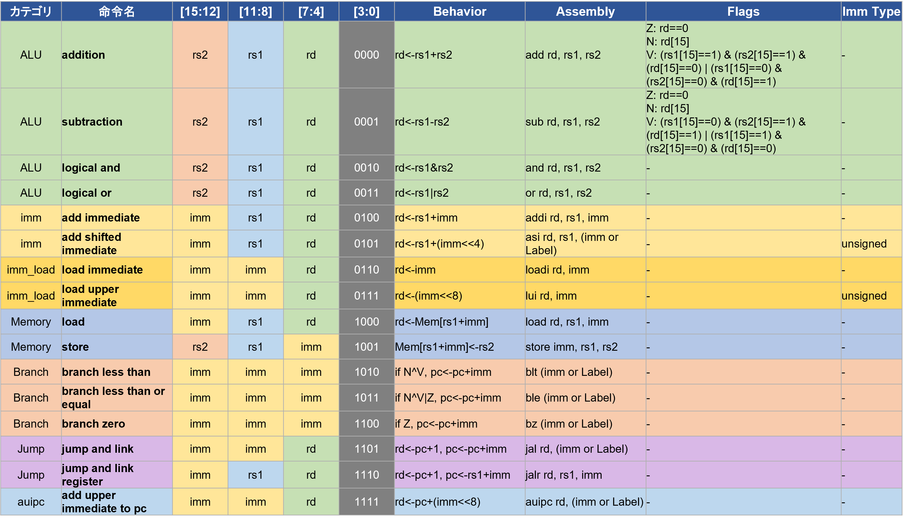
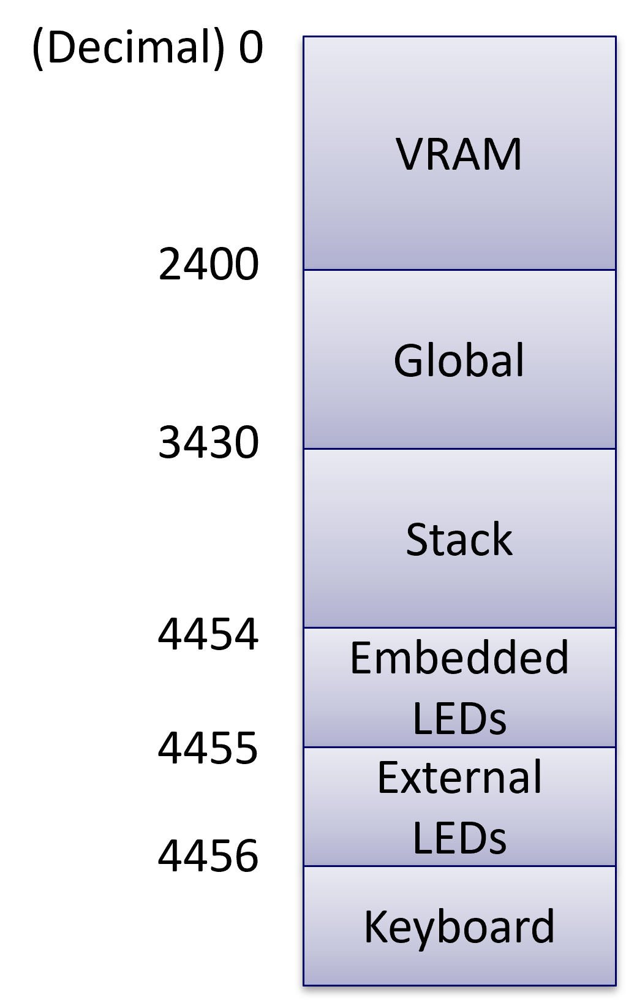

# kosugi_CPU0626

自作16bit ISA・CPUコアと、対応するCコンパイラ・アセンブラ、周辺HWドライバ一式。

## システム接続関係



Cプログラム(オセロ)をコンパイラでバイナリに変換し、命令メモリ経由でCPUに供給する。CPUはデータメモリを介してVRAM・キーボードドライバとやり取りし、HDMIドライバでディスプレイに出力する。赤枠が本リポジトリで自作した部分(コンパイラ、Cプログラム、CPU、キーボードドライバ、キーボード)。

##　CPUスペック

| 項目 | 値 |
|---|---|
| 実体 | TangNano9K (FPGA) に書き込み |
| 動作周波数 | 可変 |
| 命令数 | 16 |
| 命令セット | 手動定義 |
| Verilog回路 | Gemini 3 Flash で自動生成 |
| データ幅 | 16bit |
| レジスタ数 | 16 |
| 命令語長 | 16bit |
| ゼロレジスタ | R0 |

## 構成

- `ISA_definition.yaml` — 命令セット定義(命令一覧・ビットフィールド・フラグ仕様)
- `CPU/` — CPUコア(Verilog RTL)、Verilatorシミュレーション・論理合成スクリプト
- `COMPILER/` — Cコンパイラ(`compiler/`)とアセンブラ(`assembler/`)、テストプログラム(`programs/`)
- `HW_DRIVER/` — HDMI出力・マトリクスキーボード等のFPGA周辺ドライバ(Verilog)
- `KiCad/` — 基板(キーボード)のKiCadプロジェクト

## ISA



16bit固定長、ALU系・即値系・メモリアクセス系・分岐/ジャンプ系の命令を定義(詳細は [ISA_definition.yaml](ISA_definition.yaml))。

## データメモリマップ



データメモリ(0〜)はVRAM・グローバル変数領域・スタックの後ろに、LEDやキーボード入出力用のメモリマップドI/Oを配置している。

## 実装メモ

- Cコンパイラ: [9cc](https://github.com/rui314/9cc) を参考に自作。フロントエンドはLL(1)構文解析、バックエンドはスタックマシン向けコード生成。
- アセンブラ: Claude Codeで作成。長距離ジャンプは `auipc` + `asi` + `addi` に変換してアドレス16bitを充填する。

### 規模感

- Cコンパイラ本体: 約560行(C言語)
  - `stdio.h` などの標準ライブラリはinclude不可。入出力関数は自作(`printf`/`scanf`等は使用不可)
  - 宣言できる型は `int` のみ(すべて16bit確保)。構造体・2次元配列は未対応
- 生成アセンブリ: 約16200行(スタックマシン向け・最適化なしのコンパイラのため冗長だが、ちゃんと動作する)
- 生成バイナリ: 16bit × 16245命令 = 32490byte ≈ 32KB

## シミュレーション

### Cプログラムをコンパイル→アセンブルし、CPUの命令メモリに書き込む

```sh
cd COMPILER
./test.sh
```

`programs/myothello.c` をコンパイル・アセンブルし、`CPU/rtl/memory/imem/machine_code_bin.dat` に機械語を書き込みます。

### CPUをシミュレーション

```sh
cd CPU/script
./build_verilator.sh
```

Verilatorでビルドし、`tb_top_gen.cpp` によるテストベンチを実行します(波形: `tb_top_gen.vcd`)。

### 論理合成・回路図生成

```sh
cd CPU/script
./synthesize.sh
```

`rtl/cpu/` 配下の各モジュールをyosysで論理合成し、netlistsvgで回路図(SVG)を生成します。
